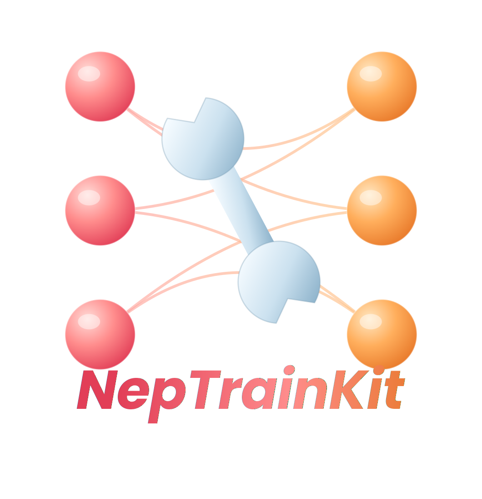

<div align="center">
<a href="https://github.com/aboys-cb/NepTrainKit">
  
</a><br>
<a href="https://pypi.org/project/NepTrainKit"></a>
<a href="https://python.org/downloads"></a>
<a href="https://codecov.io/github/aboys-cb/NepTrainKit"></a>
<a href="https://github.com/aboys-cb/NepTrainKit/blob/master/LICENSE"></a>
<br><br>
<a href="./README.md">English</a> | <strong>简体中文</strong>
</div>

# NepTrainKit

NepTrainKit 是面向神经演化势（NEP）训练集准备、评估和可视化的桌面工具。它不替代 GPUMD 的长时间训练，也不替代 DFT 计算；它负责训练前后最容易反复手工处理的部分：生成候选结构、清理异常样本、筛选代表结构，并把准备好的数据接回 DFT 和 GPUMD 工作流。

## 主要功能

- **Make Dataset**：通过可组合的卡片生成应变、扰动、缺陷、表面、掺杂、磁性和溶剂化候选结构。
- **NEP Dataset Display**：查看结构、误差和分布，删除异常样本，并导出干净的数据子集。
- **代表性筛选**：使用最远点采样（FPS）等方法，从候选池中选出更少、更有代表性的结构。
- **训练结果回看**：加载 NEP 和 DeepMD 相关输出，定位高误差结构，识别下一轮需要补充的数据。
- **项目记录**：使用 Data Management 记录多轮迭代中的模型、数据路径和备注。

## 安装

建议在独立的 Python 环境中安装 NepTrainKit。当前版本要求 Python 3.10 或更新版本。

```bash
conda create -n nepkit python=3.10
conda activate nepkit
pip install NepTrainKit
```

安装完成后，可以使用任一命令启动：

```bash
nepkit
# 或
NepTrainKit
```

### NEP 计算后端

NepTrainKit 不再把 NEP 计算后端编译进应用程序。执行 `pip install NepTrainKit` 时，会安装独立的 `nep-adapters` 依赖：

| 平台 | 安装的后端 |
| --- | --- |
| macOS / Windows | CPU |
| Linux x86_64 | 同一个 wheel 包含 CPU 和 CUDA |

Linux CUDA 路径需要兼容的 NVIDIA 驱动，但安装 wheel 不要求本机安装 CUDA Toolkit 或 NVCC。源码构建和受支持的 CUDA 架构见 [NEPAdapters 仓库](https://github.com/MagTheoryLab/NEPAdapters)。

启动后，可以在 `Settings → NEP Backend` 中选择 `Auto`、`CPU` 或 `CUDA`。`Auto` 会在 wheel、驱动和模型都支持时使用 CUDA；否则 NepTrainKit 会说明原因并继续使用 CPU。明确选择 `CUDA` 时如果不可用会直接报错，不会静默切换后端。

`设置 → NEP 设置 → NEP 运行时更新` 可以单独检查并安装兼容的 `nep-adapters` 更新，无需更新 NepTrainKit。每次打开软件后还会在后台检查运行时：没有更新或网络检查失败时保持静默，发现新版本时弹出安装提示。pip 安装版把更新后的 wheel 解压到用户配置目录；Windows 独立版放在 `NepTrainKit.exe` 旁的 `runtime/nep-adapters/versions`。新版本通过 SHA256 和独立进程健康检查后才会激活，并在重启程序后生效。

可以用下面的命令确认当前运行时：

```bash
python -c "import nep_adapters as n; print(n.backend_status('cpu')); print(n.backend_status('cuda'))"
```

### Windows 可执行包

如果不想在本地编译，可以从 [GitHub Releases](https://github.com/aboys-cb/NepTrainKit/releases) 下载 `NepTrainKit.win32.zip`。该包仅面向 Windows。

## 文档与支持

- 用户文档：[neptrainkit.readthedocs.io](https://neptrainkit.readthedocs.io/zh-cn/latest/)
- 更新说明：[GitHub Releases](https://github.com/aboys-cb/NepTrainKit/releases)
- 问题反馈与功能建议：[GitHub Issues](https://github.com/aboys-cb/NepTrainKit/issues)
- 社区交流：[QQ 群链接](https://qm.qq.com/q/wPDQYHMhyg)

第一次使用时，建议先阅读用户文档中的“快速开始”和“候选结构清洗后再进入 DFT”。如果已经知道需要补充哪类结构，可以直接查阅 Make Dataset 卡片手册。

## 引用

如果 NepTrainKit 对你的研究有所帮助，请引用：

```bibtex
@article{CHEN2025109859,
title = {NepTrain and NepTrainKit: Automated active learning and visualization toolkit for neuroevolution potentials},
journal = {Computer Physics Communications},
volume = {317},
pages = {109859},
year = {2025},
issn = {0010-4655},
doi = {https://doi.org/10.1016/j.cpc.2025.109859},
url = {https://www.sciencedirect.com/science/article/pii/S0010465525003613},
author = {Chengbing Chen and Yutong Li and Rui Zhao and Zhoulin Liu and Zheyong Fan and Gang Tang and Zhiyong Wang},
}
```

## 许可证和第三方代码

本仓库使用 GNU General Public License v3.0 or later，详见 [LICENSE](./LICENSE)。

NEP 计算由独立依赖 [nep-adapters](https://github.com/MagTheoryLab/NEPAdapters) 提供。NepTrainKit 已不再内置 NEP_CPU 或 GPUMD 后端源码。

本仓库仍需保留的来源说明见 [THIRD_PARTY_NOTICES.md](./THIRD_PARTY_NOTICES.md)。`nep-adapters` 发行包会携带其后端源码对应的许可证和来源说明。
