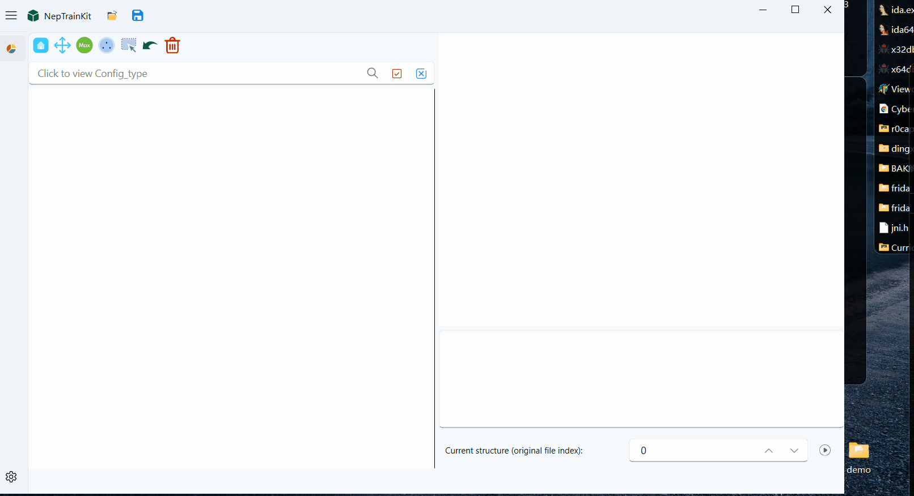
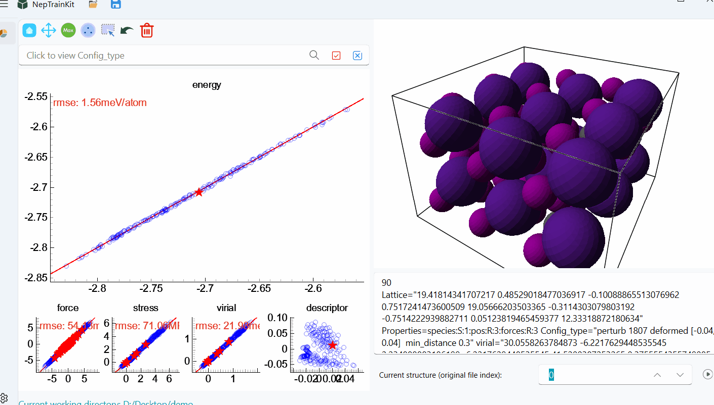
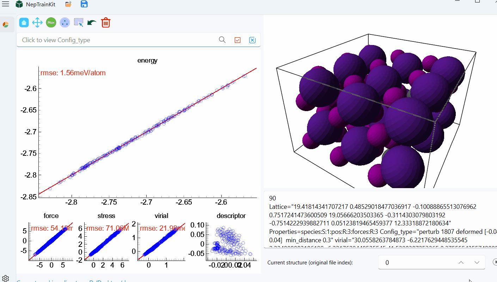

# NEP Dataset Display 操作演示

本页带你完成一次最短的“打开数据 → 看图 → 选结构 → 导出”流程。动图只演示操作位置；
参数含义和算法原理请进入对应的[功能指南](../module/NEP-dataset-display.md)。

## 开始前准备什么

| 我手里的文件 | 可以做什么 |
| --- | --- |
| 只有 `train.xyz` | 查看结构、标签和已有 DFT 数据 |
| `train.xyz` + `nep.txt` | 重新预测并比较 NEP 与参考值 |
| `train.xyz` + `energy/force/virial_*.out` | 直接回看 GPUMD 已输出的训练或测试结果 |

如果文件不能导入，先按文件类型查看[支持格式](../formats.md)，不要反复更改扩展名尝试。

## 1. 打开结构和模型

把 `train.xyz` 拖入窗口，或从顶部 `Open` 菜单选择结构文件。需要现场计算预测值时，
再打开 `nep.txt`；只查看已有标签时不必加载模型。

看完动图后检查：

- 顶部和状态栏显示的结构数量是否与文件一致；
- 主图区是否出现能量、力或 virial 图；
- 结构区能否显示当前帧。没有标签的数据不会凭空出现误差图。

## 2. 逐帧查看结构

点击播放按钮可按当前顺序逐帧切换结构。播放只改变当前显示帧，不会删除、重新排序或修改数据。

发现明显异常时先暂停，再记录当前结构编号或将其标记。大数据集不适合只靠播放检查，
应结合误差、几何过滤和搜索条件缩小范围。

## 3. 从最大误差回到原结构

最大误差工具按当前图中参考值与预测值的差异找结构。能量图通常一行对应一个结构；
力图会先把原子分量映射回结构并去重。

运行后不要只看“选中了多少个”。点击几个被选结构，确认异常来自真实的数据缺口，
而不是短键、错误晶胞、错误元素或标签损坏。详细规则见[最大误差筛选](../module/nep-main-tool-max-error.md)。

## 4. 用 FPS 选择代表结构

FPS 根据描述符距离从候选池中选择分散的代表结构。它适合减少已经清洗过的候选池，
不负责判断结构是否物理合理。

运行前先确认候选池已清除明显坏结构；运行后检查实际选择数是否因最小距离或
$R^2$ 阈值提前停止。算法和多种模式见[代表性采样](../module/nep-main-tool-sparse-samples.md)。

## 5. 在图上直接框选或反选

鼠标选择适合处理肉眼可辨的局部点群。先切到选择模式，在图中框选点，再使用反选或清除选择
调整范围；选择会同步回结构列表。

图上一个点不一定总等于一个结构：在力图和 virial 分量图中，同一结构可能贡献多行数据。
导出前应回到结构列表确认最终结构数量。

## 6. 按 `Config_type` 组合筛选

切换到标签筛选后，可以组合多个 `Config_type` 标签定位来源相近的结构。这个字段通常记录
生成卡片、计算批次或数据来源，不是化学式。

如果标签命名不统一，先用[批量编辑结构元数据](edit-structure-metadata.md)整理，再建立筛选条件。
完整表达式和元素筛选方式见[筛选栏](../module/nep-display-filter.md)。

## 7. 只导出确认过的子集

完成标记后，从 `Save` 菜单选择导出当前活动结构或所选结构。导出前最后确认状态栏中的
活动数、选中数和删除数，避免把已排除结构重新写回文件。

建议使用能表达阶段的文件名，例如 `candidate_pool_clean.xyz` 或
`max_error_review.xyz`。导出格式和字段保留规则见[支持格式](../formats.md)。

## 下一步查哪里

- 不认识主图区按钮：看[主图区工具](../module/nep-display-main-plot-tools.md)。
- 不认识结构区按钮：看[结构区工具](../module/nep-display-structure-tools.md)。
- 不会导入、导出或切换模型：看[打开数据与切换模型](../module/nep-display-open-data.md)。
- 页面没有图、数量不对或工具不可用：看[状态栏与常见提示](../module/nep-display-status-and-errors.md)。
