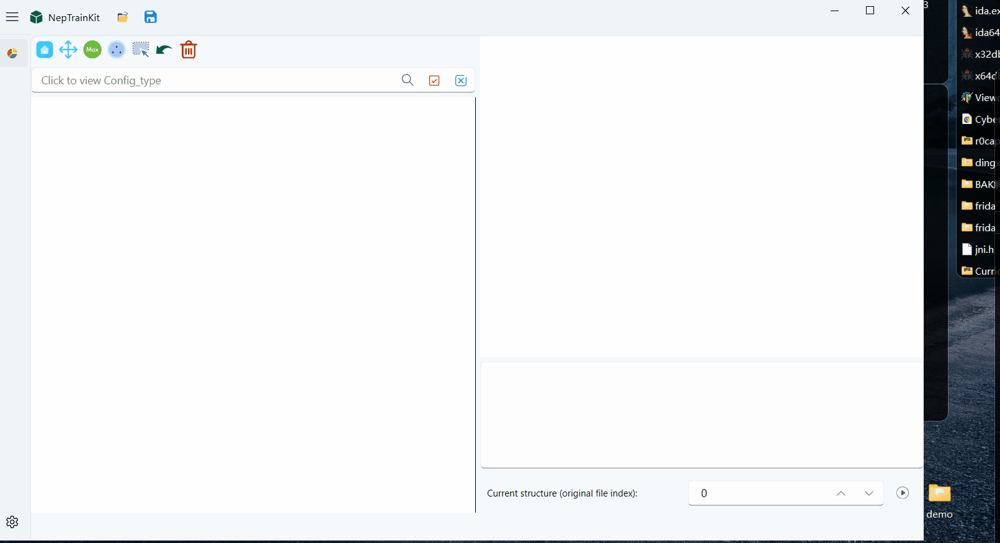
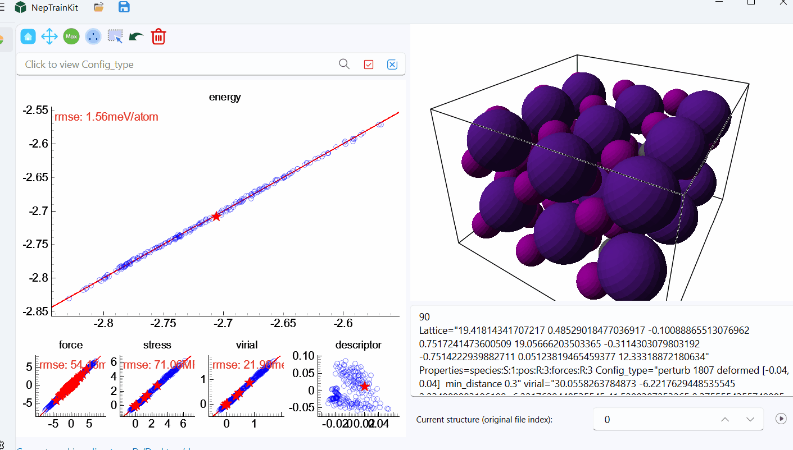
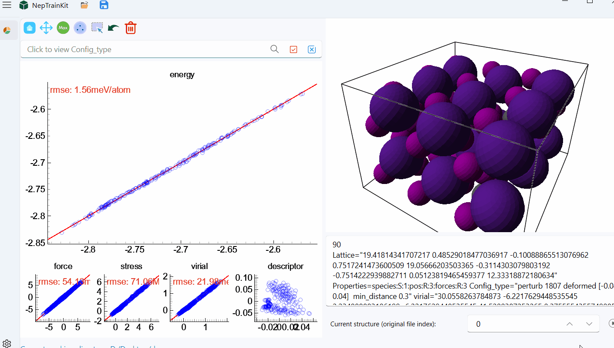

# NEP Display

## Data Import
In this section, we will use only the `nep.txt` and `train.xyz` files. You can simply drag any file into the software window to load it.

For a list of supported file formats and details (e.g., VASP OUTCAR/XDATCAR, LAMMPS dump, ASE trajectories), see: [Supported Formats](../formats.md).

Once loaded, the interface will appear as shown below, with red stars indicating the position of the structure in the training set.  

## Trajectory Playback
Next, let's introduce the trajectory playback feature. On the right side of the structure index space (SpinBox), there is a play button:  
. When clicked, it will play the trajectory frame by frame as a preview feature.

## Dataset Editing
Now, let's demonstrate how to edit and filter the training set.

:::{note}
- The training set is limited in size, and each toolset is built based on the original data, allowing continuous operations.
- The following operations are for demonstration purposes and are performed on the energy plot.
:::

### Maximum Error Point Selection
First, we select and delete the top 10 points based on the maximum energy error.  

### Sparse Sampling of Furthest Points
This training set contains about 200 structures. We set the minimum distance to 0.01 and retain a maximum of 100 structures.  

### Manual Selection
Next, we'll demonstrate how to manually select and deselect structures.  
:::{note}
- Left-click: Select a structure, either by clicking or drawing a trajectory.
- Right-click: Deselect a structure, either by clicking or drawing a trajectory.
:::

### Config_type Selection
Now, we will demonstrate how to use `Config_type` for selection.  

:::{important}
This tool is typically used in conjunction with the three features mentioned above to more precisely filter the structures.
:::

Below is an example of how `Config_type` can be combined with the sparse sampling of furthest points. Based on the sparse sampling, we retain the AIMD structures.  

## Exporting the Dataset
Finally, after deleting the selected structures, we can export the filtered dataset.  

