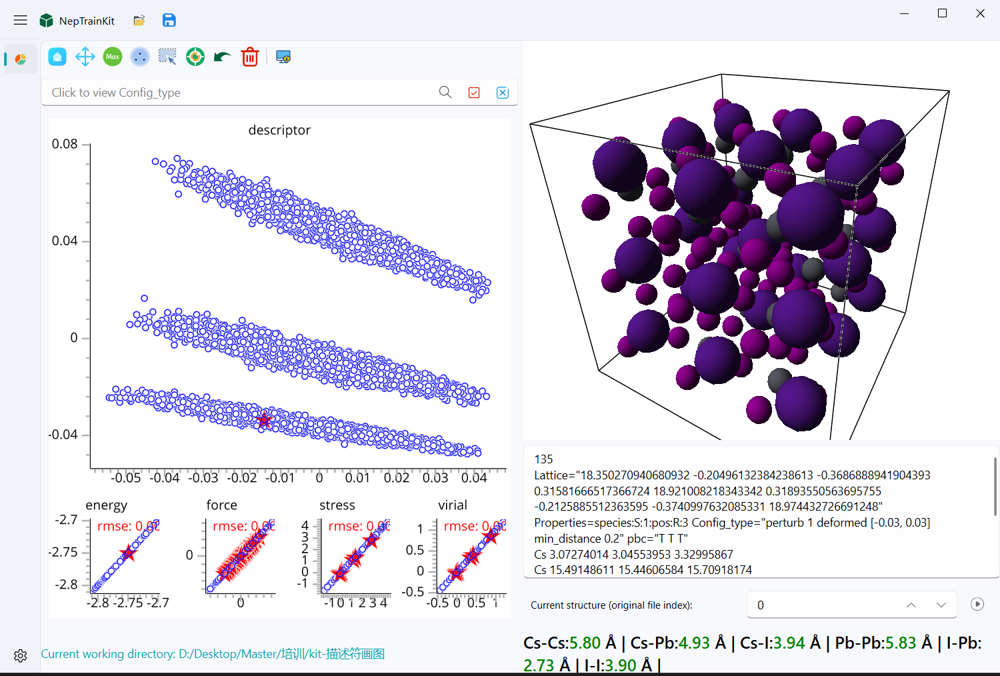
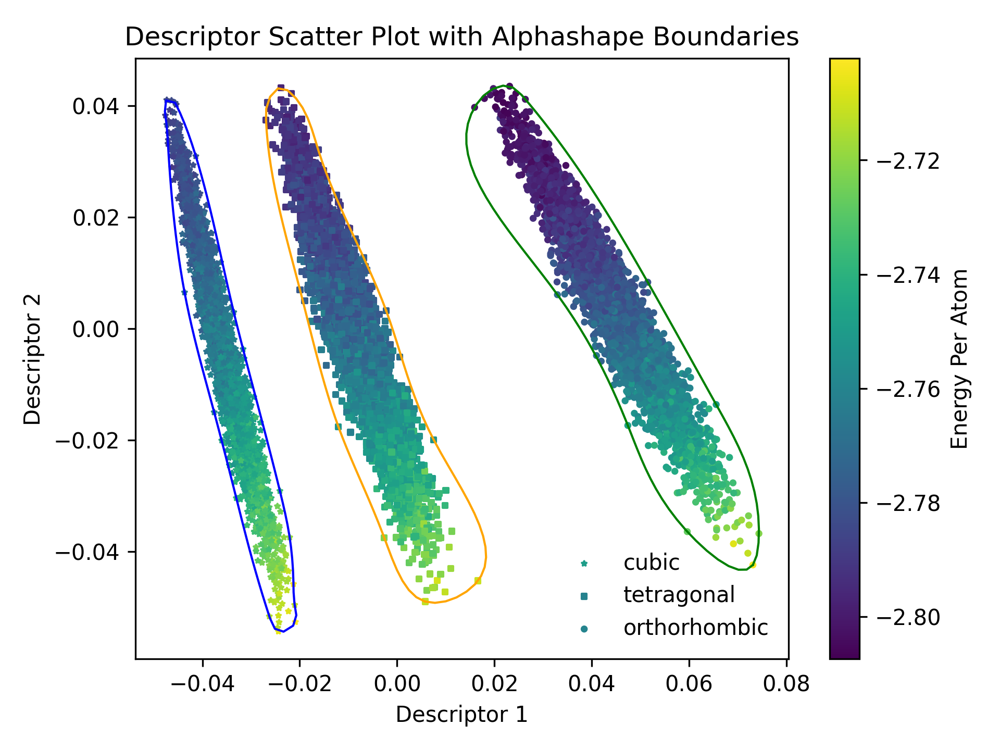

# Descriptor 绘图示例

以 CsPbI3 为例，导出 descriptor 后绘制结构分布。

## 导出步骤

1. 选择结构：
2. 点击导出：
3. 选择文件路径

## 绘图

使用 [plot_descriptor.py](https://github.com/aboys-cb/NepTrainKit/blob/master/tools/plot_descriptor.py)，
配置 `config` 和 `method` 后执行：

`python plot_descriptor.py`

