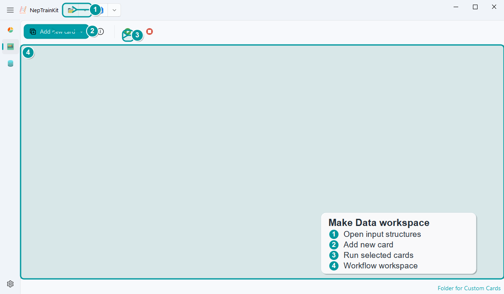
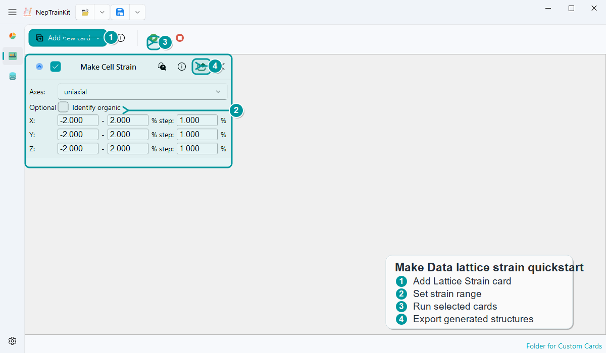
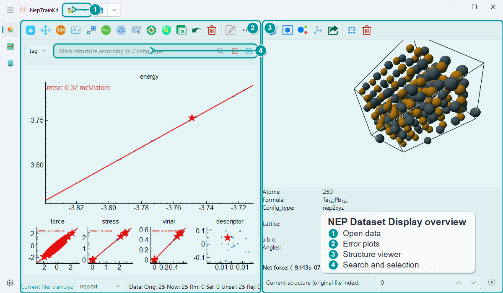

NepTrainKit 文档
================

NepTrainKit 是给 NEP 训练集准备、检查和可视化用的桌面工具。它不替代 GPUMD
在服务器上的长时间训练，也不替代 DFT 计算；它负责训练前后最容易反复手工处理的部分：
生成候选结构、查看结构是否合理、剔除异常样本、做代表性筛选，并把干净的数据导出回你的
DFT 和训练流程。

如果你第一次打开软件，可以先按下面两条主线理解界面。

制作一批候选结构
----------------

``Make Dataset`` 的作用是制作训练集候选结构。它产出的结构通常还不能直接拿去训练：
扰动、缺陷、表面、随机占位等操作都可能生成局部距离过近、受力异常或明显不合理的构型。
这些结构应该先被检查和清洗，再进入 DFT。

最小工作流只有三步：

1. 先导入初始结构。
2. 添加一张生成或变换卡片。
3. 勾选需要参与运行的卡片并点击 ``Run``。
4. 在工作区检查每张卡的输入、参数和输出数量。

下面是一张 ``Lattice Strain`` 卡配置后的样子。它会对输入结构施加一组受控晶格应变，
适合用来补弹性响应附近的数据。

不知道该选哪张卡时，先看 :doc:`module/make-dataset-cards/index`；已经知道目标时，
可以直接查 :doc:`module/make-dataset-cards/recipes`。完整的候选结构清洗路线见
:doc:`workflows/clean-candidate-structures`。

检查和筛选结构
--------------

``NEP Dataset Display`` 不只用于训练结束后的误差分析。只要你已经有一批结构，
就可以把它们导入这里查看、标记、删除和导出。对于 ``Make Dataset`` 生成的大批候选结构，
一个常见做法是先用内置或已有 NEP 模型做快速预测，去掉明显异常的结构，例如预测力特别大的样本；
清洗后再做最远点采样，最后把代表结构送去 DFT。

图里的四个区域对应一次常见检查：

1. 打开候选结构、训练结构或训练结果目录。
2. 看预测值、误差或分布，先定位最明显的问题。
3. 直接查看对应结构，判断它是不是坏构型、边界情况或训练集缺口。
4. 用标签、搜索和选择功能把这些结构单独标出来，再导出或删除。

更细的按钮说明见 :doc:`module/show-nep-reference`。

一条更真实的路线通常是：

.. code-block:: text

   Make Dataset 生成候选结构
   -> NEP Dataset Display 查看并清洗异常结构
   -> FPS Filter 或其他方法选择代表结构
   -> DFT 标注能量、力、应力
   -> GPUMD 训练 NEP
   -> NEP Dataset Display 回看训练结果并继续迭代

从哪里开始
----------

.. grid:: 1 1 2 2
   :gutter: 2

   .. grid-item-card:: 我想先跑通一次
      :link: quickstart
      :link-type: doc

      从安装、启动到生成候选结构，并理解为什么要先清洗再 DFT。

   .. grid-item-card:: 我想清洗候选结构
      :link: workflows/clean-candidate-structures
      :link-type: doc

      从 Make Dataset 输出候选池，到 Show NEP 删除异常结构，再采样去 DFT。

   .. grid-item-card:: 我想分析已有训练结果
      :link: module/NEP-dataset-display
      :link-type: doc

      加载训练结构或训练结果，看误差、筛异常、导出子集。

   .. grid-item-card:: 我想系统扩充训练集
      :link: module/make-dataset-cards/index
      :link-type: doc

      按物理目的生成候选结构，然后接入清洗和采样流程。

   .. grid-item-card:: 我想写自己的卡片
      :link: module/custom-card-development
      :link-type: doc

      把已有脚本封装成 Make Dataset 卡片，供团队复用。

安装提示
--------

使用 ``pip`` 安装时会自动检测 CUDA。若检测到可用 CUDA，将构建 GPU backend；
否则构建 CPU backend。如需手动指定 CUDA，请在安装前设置 ``CUDA_HOME`` 或
``CUDA_PATH``。完整命令见 :doc:`quickstart`。

引用 NepTrainKit
----------------

如果你的研究使用了 NepTrainKit，请引用：

.. code-block:: bibtex

   @article{CHEN2025109859,
   title = {NepTrain and NepTrainKit: Automated active learning and visualization toolkit for neuroevolution potentials},
   journal = {Computer Physics Communications},
   volume = {317},
   pages = {109859},
   year = {2025},
   issn = {0010-4655},
   doi = {https://doi.org/10.1016/j.cpc.2025.109859},
   url = {https://www.sciencedirect.com/science/article/pii/S0010465525003613},
   author = {Chengbing Chen and Yutong Li and Rui Zhao and Zhoulin Liu and Zheyong Fan and Gang Tang and Zhiyong Wang},
   }

.. toctree::
   :maxdepth: 2
   :caption: 文档目录

   快速开始 <quickstart>
   工作流 <workflows/index>
   支持格式 <formats>
   功能模块 <module/index>
   示例 <example/index>
   API 参考 <api/index>
