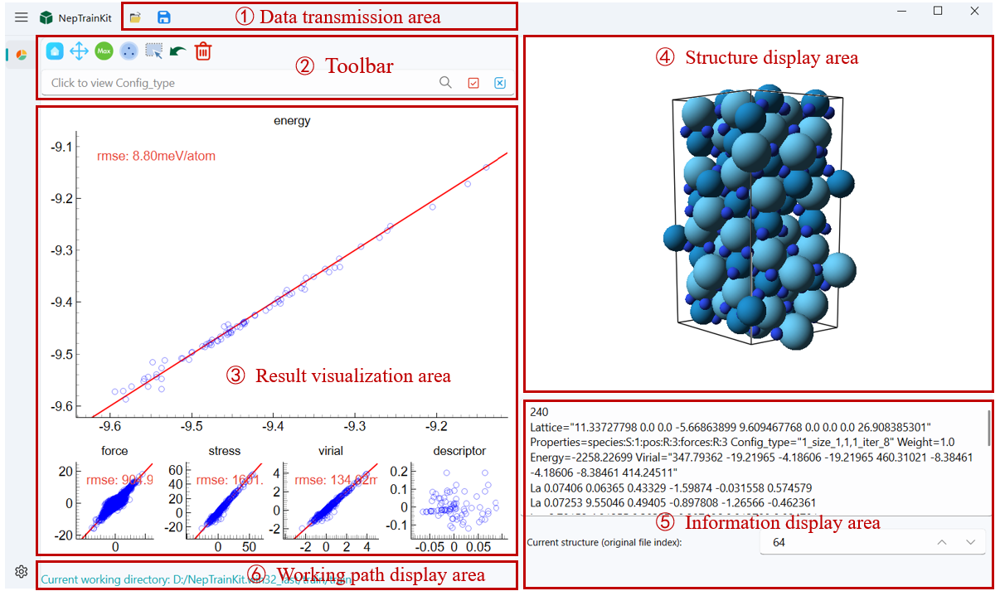
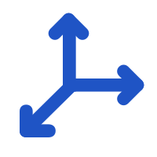
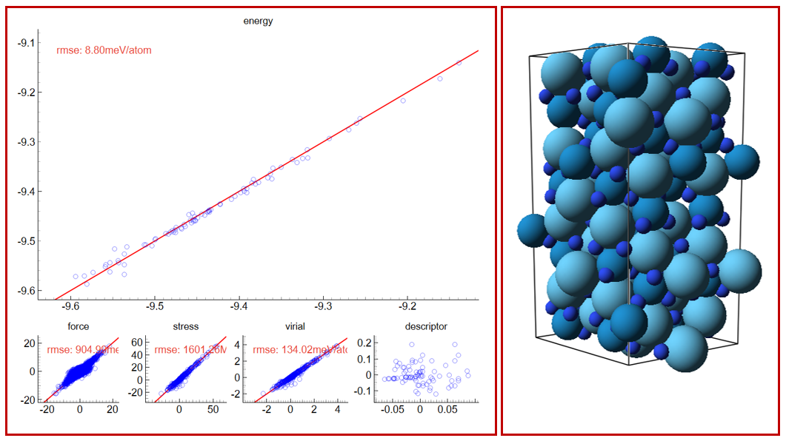
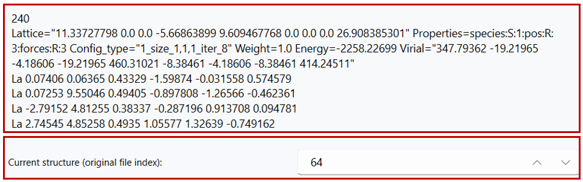

# NEP Dataset Display

## 1.User Interface

As shown in the figure, the overall user interface of the software primarily includes the toolbar, result visualization area, structure display area, information display area, and working path display area.

## 2.Data transmission area

### Data Import

Users can import files in the following two ways:

- Click the import button located at the top left of the menu  to import the file path.
- Drag and drop the file directly into the software interface for import.
:::{important}
software will automatically detect the `nep.txt` file type and import it, including the `norm`、`dipole` and `polarizability`.
Currently supported formats are documented here: [Supported Formats](../formats.md).
Common cases include:
- `train.xyz` with matching `*.out` files
- `nep.txt` (optional; falls back to NEP89 if absent) + `train.xyz`
- DeepMD training directory (auto‑detected)
:::

Note:
- If the expected `*.out` files are missing or incomplete, NepTrainKit can recompute predictions using the selected NEP backend (CPU/GPU) and write fresh outputs. Choose the backend in Settings → NEP Backend; Auto tries GPU first and falls back to CPU.

 
### Data Export

After completing the operation, the user can click the save button 
to export the results as two files:

- **export_remove_model.xyz**: Contains information about the deleted structures.
- **export_good_model.xyz**: Contains information about the remaining structures.
In the export menu, you can click "Export Selected Structures" to export the currently selected structures.
## 3.Toolbar

### Results Toolbar (with icons)

-  Reset View: Restores auto-range and clears temporary modes.
-  Pan View: Toggle panning/zoom with mouse drag and wheel.
-  Select by Index:
  - Input: index expression; supports Python-like slices `1:10`, `:100`, `::3` and lists `1, 5, 9`.
  - Toggle: “Use original indices” to interpret expression in original file order; otherwise uses current view indices mapped back to originals.
-  Select by Range:
  - Input: `x_min`, `x_max`, `y_min`, `y_max`, and logic `AND`/`OR` to combine masks.
  - Uses the currently active subplot (e.g., energy, force, descriptor projection).
-  Find Max Error Point:
  - Input: `N` (count of structures).
  - Behavior: on the active subplot, computes per-structure error (sum of absolute residuals) and selects top-`N` unique structures.
-  Sparse samples (FPS):
  - Inputs: `Max num`, `Min distance` (in descriptor space), and optional `Use current selection as region`.
  - Behavior:
    - If the region option is checked, FPS runs only on the subset of points that correspond to the currently selected structures (mapped onto the active subplot). When FPS sampling is performed in the designated area, the program will automatically deselect it, just click to delete! If no selection is present or it does not map to any points, the tool falls back to global FPS.
    - Otherwise, FPS runs globally on all points in the active subplot.

-  Mouse Selection: Toggle selection mode; left-drag to select, right-click to deselect.
-  Find non-physical structures:
  - Parameter: uses Settings → “Covalent radius coefficient” to detect too-short bonds.
  - Behavior: scans all visible structures; selects those below threshold.
-  Inverse Selection: Invert current selection.
-  Undo: Restore the last deletion.
-  Delete Selected Items: Remove selected structures from the current set.
-  Edit Info:
  - Input: add key/value pairs or remove existing keys on all selected structures.
  - Values: numbers or JSON (e.g., arrays) are parsed automatically; otherwise treated as text.
-  Export structure descriptor:
  - Output: TSV with selected descriptors; when available, appends the reference energy column.
-  Energy Baseline Shift:
  - Inputs: group regex patterns (`;` or `,` separated), Max generations, Population size, Convergence tol, Alignment mode.
  - Modes:
    - REF_GROUP: shift each regex group toward the mean energy of the currently selected reference structures.
    - ZERO_BASELINE: shift each group toward zero energy.
    - DFT_TO_NEP: shift toward NEP energies (requires loaded NEP energy array).
-  DFT D3:
  - Inputs: Functional (e.g., pbe, scan, b3lyp), D3 cutoff, D3 cutoff_cn, Mode.
  - Modes:
    - NEP Only: overwrite with NEP predictions.
    - DFT-D3 only: overwrite with D3 corrections (diagnostic mode).
    - NEP with DFT-D3: overwrite with NEP + D3.
    - Add DFT-D3 / Subtract DFT-D3: add/subtract D3 corrections to current values.

### Structure Toolbar (with icons)

-  Ortho View: Toggle orthographic projection.
-  Automatic View: Auto-center and fit to view.
-  Show Bonds: Toggle bonds; threshold from covalent radii × coefficient (Settings).
-  Show Arrows:
  - Input: choose a per-atom vector property (Nx3), colormap, and scale.
  - Behavior: overlays arrows of the chosen vector field.
-  Export current structure: Save the current structure as XYZ.

### Search and Select (with icons)

-  Search Tool: search a single Config_type for prefix/suffix/substring.

:::{important}
After clicking Search, matched structures turn green but are not selected. Use Select/Deselect to change selection state.
:::

-  Select Button: Select matched structures.
-  Deselect Button: Deselect matched structures.
-  Search by formula: toggle the small “formula” checkbox next to the search box to switch between searching by `Config_type` (default) and by chemical formula. Autocompletion updates to your available formulas.

:::{important}
After clicking the search button, the relevant structures will turn green to indicate the search results. However, at this point, the structures will not be selected. You will need to perform additional actions to complete the selection.
:::

:::{important}
If there are no **Config_type** available, clicking the **Select** button will select all visible items, and clicking the **Deselect** button will deselect all items.
:::
### Search by formula

- Toggle the small "formula" checkbox next to the search box to switch between searching by `Config_type` (default) and searching by chemical formula.
- When formula mode is enabled, autocompletion updates to your available formulas.
## 4.Result Visualization and Structure Display

- The result visualization area consists of five subplots, displaying the descriptors, energy, force, pressure, and potential energy information of the dataset. We use the **pyqtgraph** library to encapsulate the plotting functions, and all five subplots support switching to the main plot by double-clicking.
- By clicking on a data point in the main plot, the corresponding crystal structure will be displayed in the right-side display area. The atom sizes and colors in the crystal structure are set based on the atomic radius and the CPK color scheme, respectively.

**Plotting Details:** During the plotting process, **energy**, **force**, **pressure**, and **potential energy** data are all read from the NEP output files in the working path. For **descriptor projection**, we use NEP_CPU to obtain the descriptor of each atom and compute its average as the structure descriptor. Then, principal component analysis (PCA) is used to project the structure descriptors into a two-dimensional space for easier visualization.

## 5.Information Display Area

- In the information display area on the right, the system will show detailed information about the selected **xyz file**. By default, when you click on any data point in the subplots, the display area on the right will synchronize and show the detailed information of the selected structure.
- Below the display area, the **frame number** of the current structure in the original file will be shown. Users can adjust the frame number to view the corresponding structure and its detailed information.

### Auto playback

- Use the play/pause button near the index to automatically step through currently visible/selected structures.
- Playback respects your current selection and stops at the end of the range.

## Appendix: Toolbar Reference

The display includes two toolbars: the Results toolbar (left panel) and the Structure toolbar (right panel). Tools act on the active/main plot unless otherwise noted.

