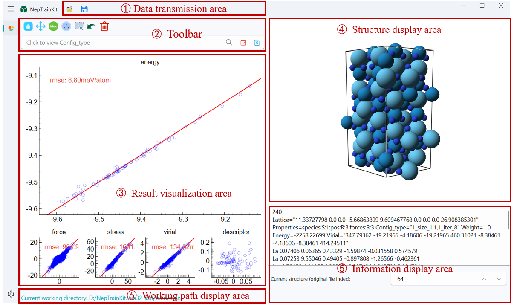

# NEP Dataset Display

## 界面概览

包括工具栏、结果可视化区、结构视图、信息区和工作路径区。

## 数据导入与导出

- 导入：Open 按钮或拖拽
- 导出：保存结果或导出当前选择

## 常用工具

- 筛选：Index/Range/Max Error/FPS/Config_type
- 编辑：Delete/Undo/Edit Info
- 分析：Export descriptor / Energy Baseline / DFT-D3
- 结构视图：Show Bonds / Show Arrows / Export current structure

## 搜索模式

- `tag`：基于 `Config_type` 正则匹配
- `formula`：基于化学式正则匹配
- `elements`：元素集合语法（`E` / `+E` / `-E`）

## 可视化说明

结果区包含 descriptor、energy、force、pressure、potential energy 子图。
点击主图点可同步查看右侧结构信息。
