# Show NEP 详细参考（`ShowNepWidget`）

> 目标：按“按钮入口”组织说明。先看按钮，再看它会不会弹窗、弹窗该填什么、执行后会发生什么。

## 1. 界面总览

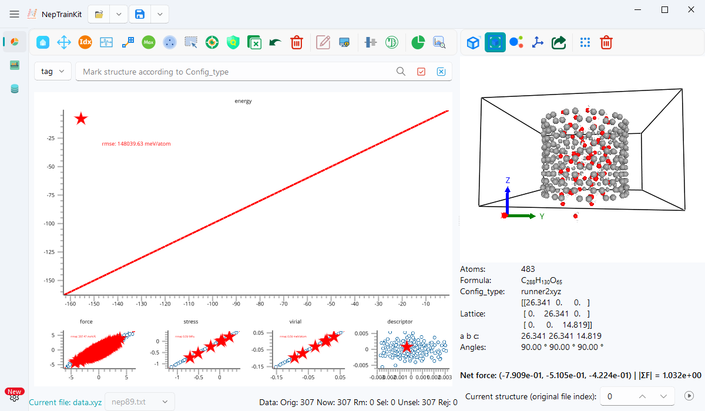

- 左侧：误差散点主图区（descriptor / energy / force / pressure / potential energy 等子图）。
- 右侧：结构区（3D 结构、结构信息、最短键长、净力、索引与播放）。
- 底部：数据状态行 `Orig / Now / Rm / Sel / Unsel / Rej`。
- 顶部：`Open` / `Save` 分裂按钮（菜单动作会随页面显示动态注入）。

## 2. 按钮与弹窗绑定总表

### 2.1 主图工具栏（左侧）

| 图标 | 按钮（Action） | 是否弹窗 | 对应弹窗类 |
|---|---|---|---|
|  | `Reset View` | 否 | - |
|  | `Pan View` | 否（toggle） | - |
|  | `Select by Index` | 是 | `IndexSelectMessageBox` |
|  | `Select by Range` | 是 | `RangeSelectMessageBox` |
|  | `Select by Lattice` | 是 | `LatticeRangeSelectMessageBox` |
|  | `Find Max Error Point` | 是 | `GetIntMessageBox` |
|  | `Sparse samples` | 是 | `SparseMessageBox` |
|  | `Mouse Selection` | 否（toggle） | - |
|  | `Finding non-physical structures` | 否（仅进度） | `QProgressDialog` |
|  | `Check Net Force` | 是 | `GetFloatMessageBox` + 进度条 |
|  | `Inverse Selection` | 否 | - |
|  | `Undo` | 否 | - |
|  | `Delete Selected Items` | 否 | - |
|  | `Edit Info` | 是 | `EditInfoMessageBox` |
|  | `Export structure descriptor` | 是（文件路径） | 路径对话框 |
|  | `Energy Baseline Shift` | 是 | `ShiftEnergyMessageBox` |
|  | `DFT D3` | 是 | `DFTD3MessageBox` |
|  | `Dataset Summary` | 是（结果展示） | `DatasetSummaryMessageBox` |
|  | `Distribution Inspector` | 是（非模态） | `DistributionInspectorMessageBox` |

### 2.2 结构工具栏（右侧）

| 图标 | 按钮（Action） | 是否弹窗 | 对应弹窗类 |
|---|---|---|---|
|  | `Ortho View` | 否（toggle） | - |
|  | `Automatic View` | 否（toggle） | - |
|  | `Show Bonds` | 否（toggle） | - |
|  | `Show Arrows` | 是 | `ArrowMessageBox` |
|  | `Export current structure` | 是 | `ExportFormatMessageBox` + 路径对话框 |
|  | `Mark Bad (Reject)` | 否（toggle） | - |
|  | `Drop All Bad` | 是（确认） | `MessageBox` |

### 2.3 顶部菜单动作

| 图标 | 菜单动作 | 是否弹窗 | 说明 |
|---|---|---|---|
|  | `Open File...` | 是 | 选择 `*.xyz` |
|  | `Open Folder...` | 是 | 选择目录（常用于 `deepmd/npy`） |
|  | `Export All...` 等导出菜单 | 是 | 先选 `ExportFormat`，再选保存路径 |

## 3. 主图工具栏（按按钮查）

### 3.1 无弹窗按钮

| 按钮 | 行为 |
|---|---|
| `Reset View` | 当前子图自动缩放回数据范围 |
| `Pan View` | 切换平移交互 |
| `Mouse Selection` | 切换多边形/点选交互 |
| `Inverse Selection` | 对当前活动结构集合执行反选 |
| `Delete Selected Items` | 删除选中结构并重绘 |
| `Undo` | 撤销最近删除；无可撤销时提示 `No undoable deletion!` |

### 3.2 有弹窗按钮（参数与绑定写在一起）

#### A. `Select by Index` → `IndexSelectMessageBox`

- 输入控件：
  - `indexEdit`：索引表达式
  - `Use original indices`：默认勾选
- 索引表达式支持：
  - 单值：`3`, `-1`
  - 切片：`1:10`, `:100`, `::3`, `10:0:-1`
  - 多段：`1:10,20,30:40:2`（逗号或空白分隔）
- 执行结果：解析后选中结构；空表达式无效果。

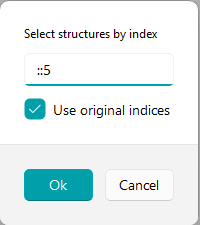

#### B. `Select by Range` → `RangeSelectMessageBox`

- 输入控件：
  - `xMin/xMax/yMin/yMax`：范围 `[-1e8, 1e8]`，6 位小数
  - `Logic`：`AND` / `OR`（默认 `AND`）
- 默认值：打开时自动填充为当前子图数据极值。
- 执行结果：按坐标窗口筛选并选中结构。

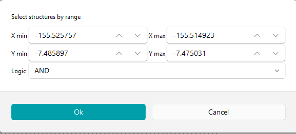

#### C. `Select by Lattice` → `LatticeRangeSelectMessageBox`

- 输入控件：`a/b/c/alpha/beta/gamma` 各 min/max。
- 范围：`[0, 1e6]`，4 位小数。
- 默认值：当前活动结构的晶格参数范围。
- 细节：内部比较带固定容差 `1e-4`。

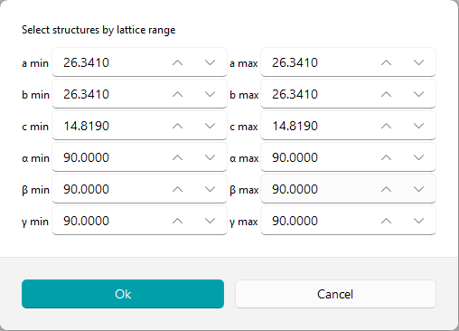

#### D. `Find Max Error Point` → `GetIntMessageBox`

- 输入控件：整数 `N`。
- 默认值：`widget.max_error_value`（缺省 `10`）。
- 执行结果：选中当前轴上误差最大的前 `N` 个结构。

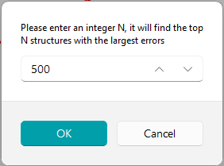

#### E. `Sparse samples` → `SparseMessageBox`

- 输入控件：
  - `Sampling mode`：`Fixed count (FPS)` / `R^2 stop (FPS)`
  - `Max num`：`[0, 9999999]`
  - `Min distance`：`[0, 10]`，5 位小数
  - `R^2 threshold`：`[0,1]`
  - `Descriptor source`：`Reduced (PCA)` / `Raw descriptor`
  - `Training dataset`：可选 `.xyz` 或目录
  - `Use current selection as region`
- 执行结果：运行 FPS 后更新选择集。

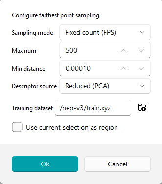

#### F. `Finding non-physical structures`（无参数弹窗，进度条）

- 参数来源：`widget.radius_coefficient`（默认 `0.7`）。
- 执行结果：扫描后选中疑似非物理结构。

#### G. `Check Net Force` → `GetFloatMessageBox`

- 输入控件：阈值 `|ΣF|`。
- 范围：`[0, 1e6]`，10 位小数。
- 默认值：`widget.force_balance_threshold`（缺省 `1e-3`）。
- 执行结果：选中超阈值结构，并显示统计消息。

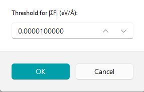

#### H. `Edit Info` → `EditInfoMessageBox`

- 输入能力：
  - 新增标签（`key/value`）
  - 删除标签
  - 右键重命名标签
- 应用前确认：列出 `removed / renamed / added` 摘要。
- 执行结果：批量更新当前选中结构 metadata。

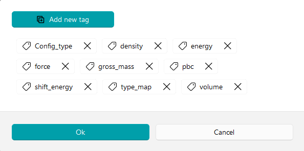

#### I. `Export structure descriptor`（路径选择）

- 路径对话框默认文件名：`export_descriptor_data.out`。
- 执行结果：后台导出描述符。

#### J. `Energy Baseline Shift` → `ShiftEnergyMessageBox`

- 预设区：`presetCombo` + 导入/导出/删除按钮。
- 参数区：`groupEdit`、`alignment mode`、`max generations`、`population size`、`convergence tol`。
- 保存区：`Save baseline as preset` + `Preset name`。
- 执行结果：后台拟合/应用基线平移并重绘。

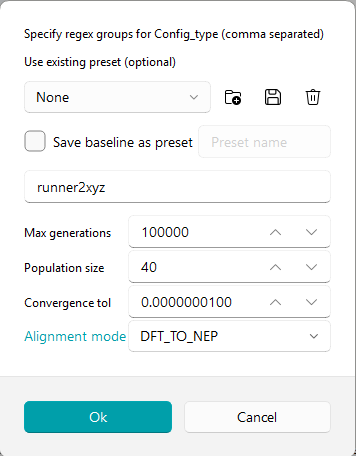

#### K. `DFT D3` → `DFTD3MessageBox`

- 输入控件：`functional`、`D3 cutoff`、`D3 cutoff_cn`、`mode(Add/Subtract)`。
- 执行结果：后台应用 DFT-D3 修正并重绘。

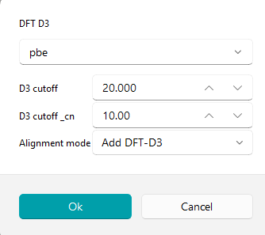

#### L. `Dataset Summary` → `DatasetSummaryMessageBox`

- 无前置输入；根据当前数据集统计。
- 结果窗口内可导出 HTML。

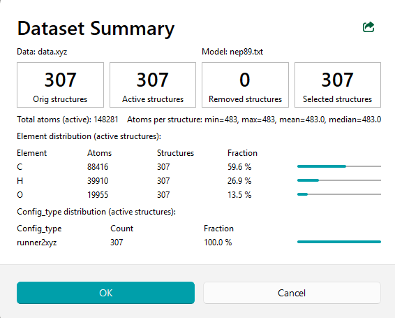

#### M. `Distribution Inspector` → `DistributionInspectorMessageBox`

- 输入控件：`Field / Group / Scope / View / Select mode / Bins / Curve / Include norm`。
- 结果控件：`Metric / Series` 联动图；点击 bin 反向选择结构。
- 执行结果：分布分析 + 选择回写主图。

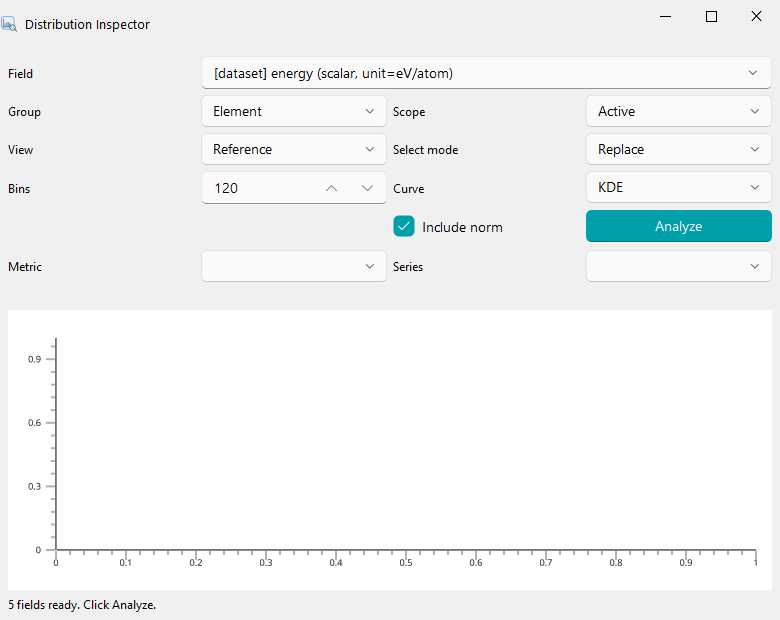

## 4. 结构工具栏（按按钮查）

### 4.1 相机与显示控制

| 按钮 | 行为 |
|---|---|
| `Ortho View` | 切换正交投影 |
| `Automatic View` | 自动视角/距离对齐 |
| `Show Bonds` | 显示/隐藏键；图标在 `show_bond/hide_bond` 间切换 |

### 4.2 `Show Arrows` → `ArrowMessageBox`

- 前提：当前结构画布必须支持箭头 API（通常 vispy）。
- 输入控件：
  - `Property`：仅 `N x 3` 原子向量属性
  - `Scale`：`[0, 1000]`，默认 `1.0`
  - `Colormap`：`viridis/magma/plasma/inferno/jet`
  - `Show arrows`：勾选显示，取消则清除

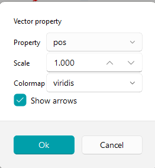

### 4.3 `Export current structure` → `ExportFormatMessageBox`

- 第一步：选格式
  - `XYZ (.xyz / extxyz)`
  - `DeepMD/NPY (deepmd/npy)`
- 第二步：选路径
  - `xyz`：文件保存路径（默认 `structure_{index}.xyz`）
  - `deepmd/npy`：目录保存路径

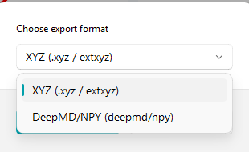

### 4.4 `Mark Bad (Reject)` 与 `Drop All Bad`

- `Mark Bad (Reject)`：只标记，不删除；主图显示 reject 高亮。
- `Drop All Bad`：弹确认框后删除所有 active bad；删除后清空 reject 集合并重绘。

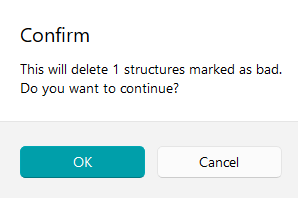

## 5. 导入导出与 NEP 模型切换

### 5.1 导入

- `Open File...`：选择 `*.xyz`。
- `Open Folder...`：选择目录（`deepmd/npy` 常见）。
- 拖拽：仅接受 `matches_result_loader()` 支持的路径。
- 若已有工作路径，切换前会二次确认。
- 加载过程在后台线程执行；`StateToolTip` 可触发取消。

### 5.2 导出菜单（顶栏 Save）

- 动作：`Export All / Selected / Removed / Active`。
- 启用条件：数据已加载且非 busy；其中 `Selected/Removed/Active` 要求计数大于 0。
- 统一先选 `ExportFormat`，再选路径。

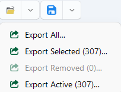

### 5.3 NEP 模型切换（路径栏右侧下拉框）

- 文件发现：扫描当前目录 `*.txt` 且文件名含 `nep`。
- 排序规则：`nep.txt` 优先，其余按字母序；最后可追加内置 `nep89`。
- 切换策略：优先命中缓存（`_nep_result_cache`）；未命中时异步重载。
- 状态保持：切换后恢复 `selected` 与 `reject`。

## 6. 搜索框（三按钮）

| 图标 | 按钮 | 行为 |
|---|---|---|
|  | 搜索 | 高亮匹配结构 |
|  | 勾选 | 将匹配结构加入选择 |
|  | 反选 | 将匹配结构移出选择 |

### 6.1 模式

- `tag`：按 `structure.tag` 正则匹配。
- `formula`：按 `structure.formula` 正则匹配。
- `elements`：元素集合语法匹配（非正则）。
- `expression`：按结构级表达式筛选；适合按原子数、元素组成、能量、力、应力、原子属性等条件批量选中。

### 6.2 `elements` 语法

- `Fe,O`：元素集合必须是 `{Fe,O}` 子集。
- `+Fe,+O`：必须同时包含 `Fe` 和 `O`。
- `-H` 或 `!H`：必须不包含 `H`。
- 可混合：`Fe,O,+Fe,-H`。

(show-nep-expression)=
### 6.3 `expression` 用法总览

- 目的：把“结构是否满足条件”写成一个布尔表达式，然后用搜索/勾选/反选按钮处理结果。
- 作用对象：仅当前 active structures；已经删除的结构不会参与表达式计算。
- 搜索按钮：高亮匹配结构。
- 勾选按钮：把匹配结构加入当前选择集。
- 反选按钮：把匹配结构从当前选择集中移除。
- 删除流程不变：通常是先用 expression 勾选，再点工具栏删除按钮。

#### 6.3.1 支持的运算符

- 逻辑运算：`&&`、`||`、`!`
- 逻辑关键字：`and`、`or`、`not`
- 比较运算：`>`、`>=`、`<`、`<=`、`==`、`!=`
- 算术运算：`+`、`-`、`*`、`/`
- 括号：`(`、`)`

示例：

- `natoms > 100`
- `has.H && natoms < 50`
- `(energy_per_atom < -3.0) && (force.norm > 10)`

#### 6.3.2 不支持的语法

- 不支持函数调用：例如 `len(structure)`、`mean(force)`、`any(...)`
- 不支持固定原子索引：例如 `atom[3].force.x > 1`
- 不支持数字分量后缀：例如 `force.1`、`stress.3`
- 不支持字符串函数或正则函数

如果需要原子数，请直接使用 `natoms`。

#### 6.3.3 内置结构字段

下列字段不依赖当前图上显示哪一个子图，始终按当前 active structures 实时计算。

| 字段 | 含义 |
|---|---|
| `natoms` | 原子数 |
| `n_atoms` | `natoms` 的别名 |
| `volume` | 晶胞体积 |
| `a` `b` `c` | 晶格长度 |
| `alpha` `beta` `gamma` | 晶格角 |
| `spin_natoms` | 有磁矩原子数 |
| `energy` | 结构总能 |
| `energy_per_atom` | 每原子能量 |
| `has_energy` | 是否存在能量 |
| `has_forces` | 是否存在力 |
| `has_virial` | 是否存在 virial |
| `has_bec` | 是否存在 BEC |

示例：

- `natoms >= 128`
- `volume < 500`
- `a > 4.5 && c < 20`
- `energy_per_atom < -4.2`
- `has_forces && !has_bec`

#### 6.3.4 元素统计字段

元素字段按当前 active structures 里实际出现过的元素动态生成。

| 字段形式 | 含义 | 示例 |
|---|---|---|
| `count.<Elem>` | 指定元素个数 | `count.Fe >= 4` |
| `frac.<Elem>` | 指定元素占比 | `frac.Li > 0.5` |
| `has.<Elem>` | 是否包含指定元素 | `has.H && natoms < 50` |

补充说明：

- `<Elem>` 使用标准元素符号，例如 `H`、`O`、`Fe`、`Li`
- 区分元素符号，不区分前缀大小写的内部解析细节；文档和输入建议始终使用标准写法
- 如果当前 active structures 中没有该元素，表达式会报错

#### 6.3.5 动态数据字段

当前结果数据里存在什么字段，expression 模式就暴露什么字段。常见来源有两类：

- 结果数据集字段：如 `force`、`mforce`、`stress`、`virial`、`dipole`、`bec`
- 原子属性字段：写成 `atomic.<name>`，例如 `atomic.spin_vec`

这意味着：

- 如果当前数据里没有 `mforce`，补全中不会出现 `mforce`
- 如果手动输入了不存在的字段，例如 `mforce.ref.x > 1`，会直接报错

#### 6.3.6 后缀规则

##### A. 数据视图后缀

对于有参考值/预测值成对存在的数据集字段，可以追加：

- `.ref`：参考值
- `.pred`：预测值
- `.err`：误差，等价于 `pred - ref`

如果省略视图后缀，默认使用 `.ref`。

示例：

- `force.x > 10` 等价于 `force.ref.x > 10`
- `stress.err.norm > 2`
- `energy.pred > -4.0`

并不是所有字段都支持这三个后缀：

- `atomic.<name>` 不支持 `.ref/.pred/.err`
- 非成对数据字段也不支持 `.pred/.err`

##### B. 分量与范数后缀

向量或张量字段支持命名分量后缀，例如：

- 三维向量：`.x`、`.y`、`.z`
- 六分量张量：`.xx`、`.yy`、`.zz`、`.xy`、`.yz`、`.zx`
- 范数：`.norm`

示例：

- `force.x > 10`
- `mforce.norm > 5`
- `virial.xx < -20`
- `atomic.spin_vec.z > 0.2`

注意：

- 不支持 `.1/.2/.3` 这类数字分量写法
- 多分量字段若不写分量或 `.norm`，表达式会报错
- 标量字段可以直接比较，例如 `energy > -10`

#### 6.3.7 原子级字段如何聚合到结构级

表达式最终必须得到“每个结构是否命中”的结果，所以原子级数据会先聚合到结构级。

默认规则：

1. 先按你写的后缀取出分量或范数
2. 再在该结构内部做 `max(abs(values))`

因此：

- `force.x > 10` 的含义是“这个结构里是否存在原子满足 `max(abs(force_x)) > 10`”
- `force.norm > 10` 的含义是“这个结构里是否存在原子满足 `max(force_norm) > 10`”
- `atomic.spin_vec.y > 0.5` 的含义也是同样的结构级最大绝对值判断

结构级字段如 `natoms`、`volume`、`energy` 不需要额外聚合，直接逐结构比较。

#### 6.3.8 常用表达式示例

##### 按结构大小筛选

- `natoms > 100`
- `natoms >= 32 && natoms <= 128`

##### 按晶格或体积筛选

- `volume < 1000`
- `a > 3 && b > 3 && c > 3`
- `gamma != 120`

##### 按元素组成筛选

- `count.O >= 4`
- `frac.Li > 0.25`
- `has.Fe && !has.H`

##### 按能量筛选

- `energy_per_atom < -3.5`
- `has_energy && energy > -500`

##### 按力、应力、virial 筛选

- `force.x > 10`
- `force.norm > 15`
- `force.err.norm > 0.2`
- `stress.xx > 5`
- `virial.err.norm > 1`

##### 按 atomic property 筛选

- `atomic.spin_vec.norm > 1.5`
- `atomic.spin_scalar > 0.1`

##### 组合条件

- `has.H && natoms < 50 && energy_per_atom < -2.5`
- `(count.Fe >= 2) && (force.norm > 8 || stress.norm > 2)`

#### 6.3.9 补全与右侧数量说明

expression 模式使用单独的动态补全，不和 `tag/formula/elements` 共用缓存。

补全来源包括：

- 内置结构字段，例如 `natoms`、`volume`
- 元素统计字段，例如 `count.Fe`、`frac.O`
- 当前数据集中真实存在的动态字段，例如 `force.ref.x`、`virial.ref.xx`
- 当前结构里真实存在的原子属性字段，例如 `atomic.spin_vec.y`

补全列表右侧的数字不是“本次搜索命中数”，而是“当前 active structures 中有多少个结构对这个候选字段是可用的/有意义的”：

- `natoms` 右侧数字通常等于当前 active structures 总数
- `count.Fe` 右侧数字表示包含 `Fe` 的结构数
- `has.H` 右侧数字表示包含 `H` 的结构数
- `force.ref.x` 右侧数字表示当前有 `force` 数据的结构数
- `atomic.spin_vec.y` 右侧数字表示当前有 `spin_vec` 原子属性的结构数

这和你实际输入完整表达式后的命中数量不是一回事。

#### 6.3.10 错误与排查

常见错误包括：

- `Unknown field in expression`
  - 字段不存在，或当前数据里没有这个字段
- `Unknown atomic field`
  - `atomic.<name>` 写错了，或当前结构没有该原子属性
- `Numeric component suffixes are not supported`
  - 使用了 `.1/.2/.3` 这类数字分量
- `Field 'xxx' requires an explicit component or '.norm'`
  - 多分量字段没有写具体分量
- `does not support value views`
  - 给不支持的字段写了 `.pred` 或 `.err`
- `Invalid expression syntax`
  - 语法不完整，例如 `force.x >`

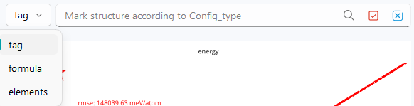

## 7. 状态与常见提示

- 数据状态：`Orig / Now / Rm / Sel / Unsel / Rej`。
- 结构状态：最短键长异常会红字提示；净力显示 `|ΣF|`。
- 播放按钮： / 。

| 提示文本 | 触发条件 |
|---|---|
| `unsupported file format` | 导入路径不支持 |
| `NEP data has not been loaded yet!` | 未加载数据即执行分析/导出 |
| `Please select some structures first!` | 导出 selected 时无选择 |
| `No active structures to export.` | 导出 active 时为空 |
| `No removed structures to export.` | 导出 removed 时为空 |
| `No undoable deletion!` | 无可撤销删除 |
| `No vector data available` | 箭头所需向量属性不存在 |
| `Arrow overlay is unavailable...` | 当前结构画布不支持箭头 API |
| `Invalid regex pattern.` | `tag/formula` 输入非法正则 |
| `Unknown element symbol: Xx` | `elements` 输入未知元素 |
| `Unknown field in expression: xxx` | `expression` 使用了不存在的字段 |
| `Numeric component suffixes are not supported in expressions.` | `expression` 使用了 `.1/.2/.3` 这类数字分量 |
| `Expression contains unsupported syntax.` | `expression` 含有不支持的语法 |
| `Invalid expression syntax.` | `expression` 语法不完整或无法解析 |

## 相关入口

- 功能概览页：[`NEP-dataset-display.md`](NEP-dataset-display.md)
- 示例页：[`../example/NEP-display.md`](../example/NEP-display.md)
